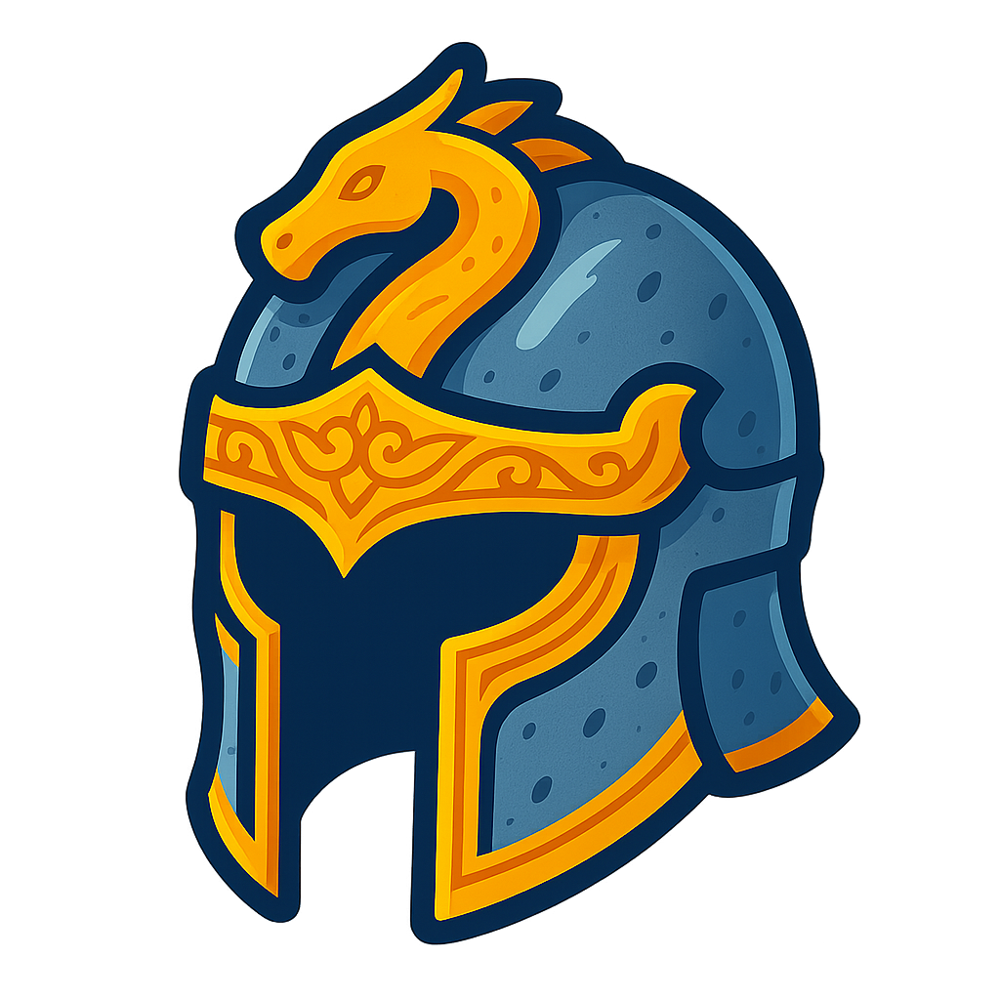
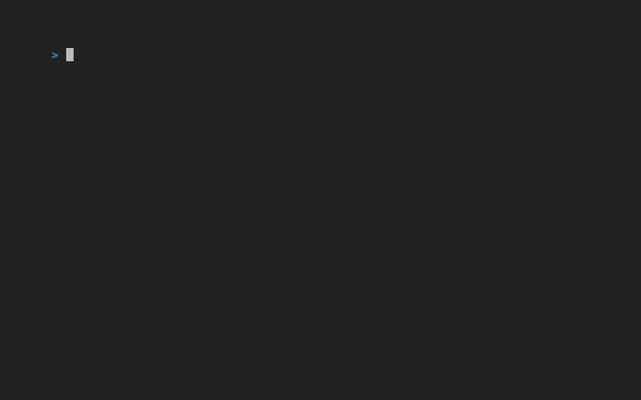

<div align="center">
  
  <h1>Helm</h1>
</div>

<div align="center">

[](https://opensource.org/licenses/MIT)
[](https://goreportcard.com/report/github.com/0xjuanma/helm)
[](https://github.com/0xjuanma/helm/releases/latest)
[](https://github.com/0xjuanma/helm/actions/workflows/build.yml)

A minimalistic TUI Pomodoro-like timer designed for pure focus. Protect your focus and time. Customize timers, switch between modes, and control everything with simple keyboard shortcuts; right from your terminal.


</div>

## Installation

```bash
curl -sSL https://raw.githubusercontent.com/0xjuanma/helm/main/scripts/install.sh | sh
```

Or build from source:

```bash
git clone https://github.com/0xjuanma/helm.git
cd helm
go build
./helm
```

## Usage

Start the Helm timer interface by running `helm` in your terminal. From there, you can start, create and customize your own timer workflows to match your needs.

### Controls

| Key | Action |
|-----|--------|
| `j/k` or <kbd>↑</kbd>/<kbd>↓</kbd> arrows | Navigate |
| `enter` | Select |
| `space` | Start/Pause |
| `r` | Reset |
| `n` | Skip to next step |
| `c` | Customize workflows |
| `esc` | Back |
| `q` | Quit |

### Workflows

- **Pomodoro** - Classic 25/5 minute work/break cycle
- **Design Interview** - Structured interview practice (customizable)
- **Custom** - Create your own workflow

Settings are stored in `~/.helm/settings.json`. Press `c` to customize workflows.

**Author:** [@0xjuanma](https://github.com/0xjuanma)
